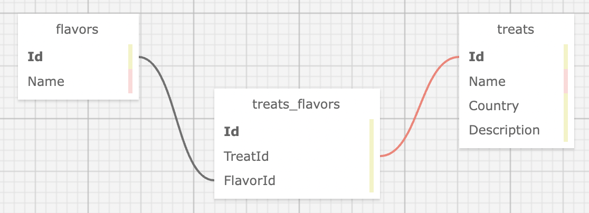

# Pierre's Treats
<!--  -->

#### Contributors: _**Claire Thorington**_

## Technologies Used

* Markdown
* HTML
* CSS
* C#
* .NET
* ASP.NET Core MVC
* Razor
* MySQL
* Entity Framework Core
* Identity

## Description & Schema

Pierre, that indefatigable entrepreneur, that pastry tycoon, that yeasty hustler, needs an online menu that customers have to log in to see and they aren't going to be happy about that. 
It's a menu for the customer who wants to know exactly what they're getting, and they have a real impact on the goods Pierre carries. CRUD-level impact. Unless I'm misinterpreting the prompt.



## Setup & Installation Requirements

* Clone repository to desktop
* Create an _appsettings.json_ file in the __Menu__ directory and copy in the following:

```
{
  "ConnectionStrings": {
    "DefaultConnection": "Server=localhost;Port=3306;database=menu;uid=root;pwd=epicodus;"
  }
}
```

* Navigate to the __Menu__ directory in your terminal and enter the following commands, in order:
```console
$ dotnet restore
$ dotnet build
$ dotnet ef migrations add Initial
$ dotnet ef database update
$ dotnet run
```

## Known Bugs

* None


## License

[<a href=LICENSE>MIT</a>]

Copyright (c) _2022_ _Claire Thorington_

  
  
